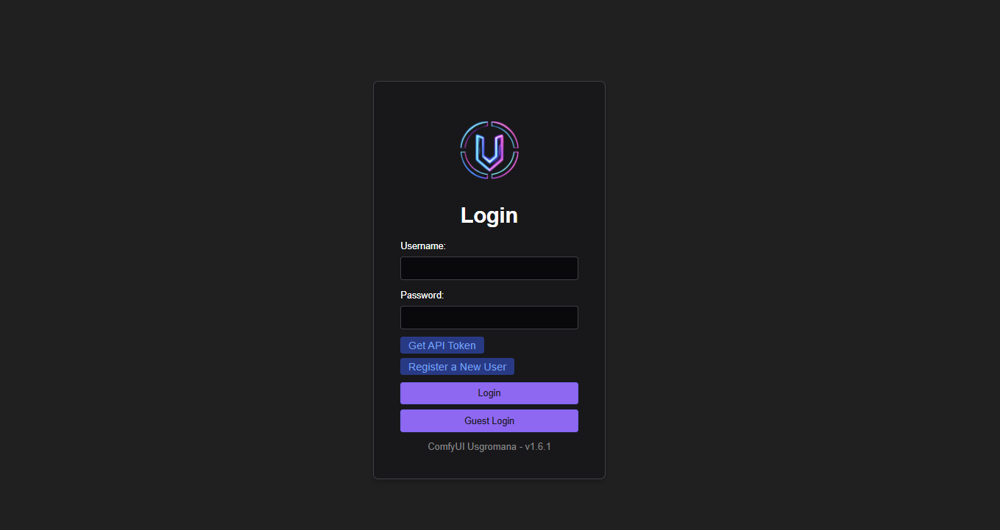
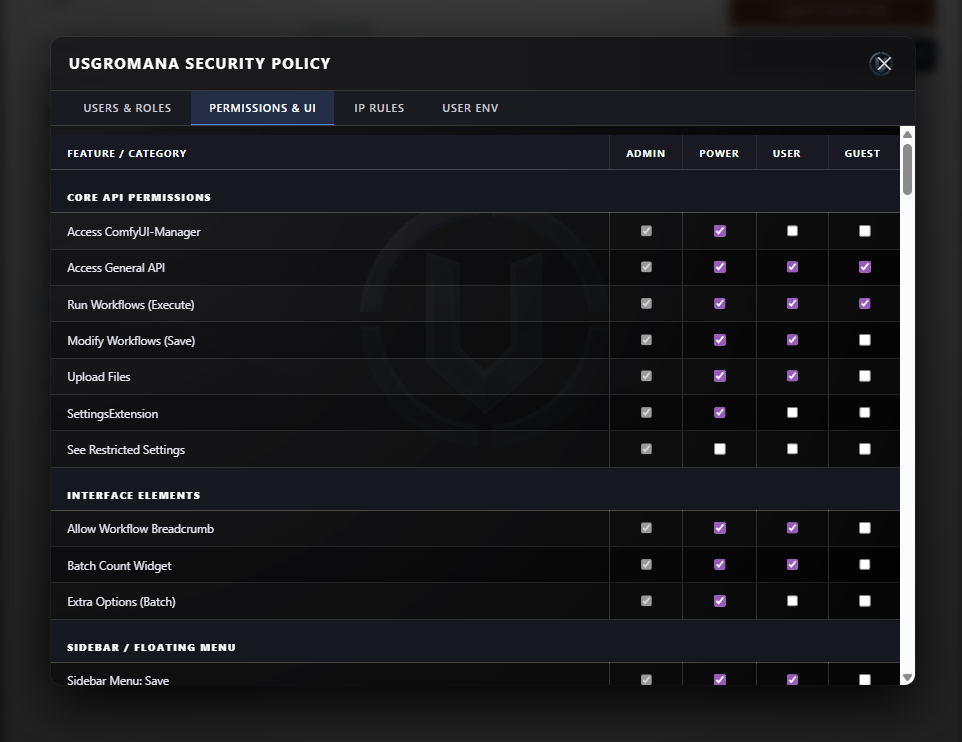
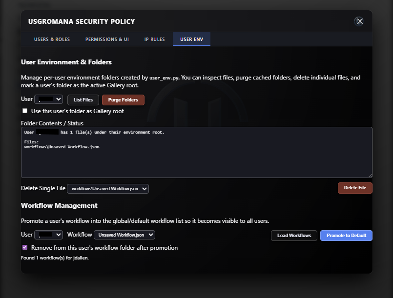

# ComfyUI Usgromana

<p align="center">
  
</p>

<p align="center">
  <strong>The next-generation security, governance, permissions, and multi‑user control system for ComfyUI.</strong>
</p>

<p align="center">
  <strong>Version 2.0.0</strong> — ComfyUI Assets integration, Comfy-User bridge, Default UI visibility, and grouped denial toasts
</p>

---

## Table of Contents
1. [Overview](#overview)  
2. [Key Features](#key-features)  
3. [Architecture](#architecture)  
4. [Installation](#installation)  
5. [Folder Structure](#folder-structure)  
6. [Configuration (config.json)](#configuration-configjson)  
7. [RBAC Roles](#rbac-roles)  
8. [UI Enforcement Layer](#ui-enforcement-layer)  
9. [Workflow Protection](#workflow-protection)  
10. [IP Rules System](#ip-rules-system)  
11. [User Environment Tools](#user-environment-tools)  
12. [Settings Panel](#settings-panel)  
13. [ComfyUI Assets Integration](#comfyui-assets-integration)  
14. [API Endpoints](#api-endpoints)  
15. [Backend Components](#backend-components)  
16. [Tests](#tests)  
17. [Troubleshooting](#troubleshooting)  
18. [Changelog](#changelog)  
19. [License](#license)

---

## Overview

**ComfyUI Usgromana** is a comprehensive security layer that adds:

- Role‑Based Access Control (RBAC)  
- UI element gating  
- Workflow save/delete blocking  
- Transparent user folder isolation  
- IP whitelist and blacklist enforcement  
- User environment management utilities  
- A modern administrative panel with multiple tabs  
- Dynamic theme integration with the ComfyUI dark mode  
- Live UI popups, toast notifications, and visual enforcement  
- **NSFW Guard API** - Public API for NSFW detection and enforcement
- **Gallery integration** - Manual image flagging and metadata-based tagging
- **Extension Tabs API** - Allow other extensions to add custom tabs to the admin panel
- **ComfyUI Assets bridge** - JWT users mapped to ComfyUI’s `Comfy-User` header; per-user output/input in the Assets and Generated tabs
- **Default UI controls** - Admin-configured global visibility for Assets / Imports (`user_specific`, `allow_all`, `disable_all`)
- **Radial Menu API** - Extensions can add buttons to the floating Usgromana radial menu

It replaces the older Sentinel system with a faster, cleaner, more modular architecture—fully rewritten for reliability and future expansion.

---

## Key Features

### 🔐 **RBAC Security**
Four roles: **Admin, Power, User, Guest**
Each with configurable permissions stored in `usgromana_groups.json`.

The guest account and login can be disabled by editing `config.json` and changing `enable_guest_account` to false

<p align="center">
  
</p>

### 🚫 **Save & Delete Workflow Blocking**
Non‑privileged roles cannot:
- Save workflows  
- Export workflows  
- Overwrite existing workflows  
- Delete workflow files  

<p align="center">
  
</p>

All blocked actions trigger:
- A server‑side 403  
- A UI toast popup explaining the denial  

### 👁️ **Dynamic UI Enforcement**
Usgromana hides or disables:
- Top‑menu items  
- Sidebar tabs  
- Settings categories  
- Extension panels  
- File menu operations  

Enforcement occurs every 1 second to catch late‑loading UI elements.

### 🌐 **IP Filtering System**
Complete backend implementation:
- Whitelist mode  
- Blacklist mode  
- Live editing in Usgromana settings tab  
- Persistent storage via `ip_filter.py`  

### 🗂️ **User Environment Tools**
From `user_env.py`:
- Purge a user’s folders  
- List user-owned files
- Promote user workflow to default (all user view)
- Delete single user workflow
- Toggle gallery‑folder mode

<p align="center">
  
</p>

### 🖥️ **Transparent Themed Admin UI**
The administrative modal features:
- Transparent blurred glass background  
- Neon accent tabs  
- Integrated logo watermark  
- Scrollable permission tables  
- Responsive layout  

### 🔧 **Watcher Middleware**
A new middleware that detects:
- Forbidden workflow saves  
- Forbidden deletes  
And triggers grouped denial toasts (`web/js/denial_toasts.js`) with deduplication and “Clear all”.

### 📦 **ComfyUI Assets & Generated Tab**
- Enables ComfyUI’s built-in assets system automatically (no `--enable-assets` flag required)
- Maps each Usgromana account to ComfyUI via the `Comfy-User` request header
- Syncs per-user `output` / `input` / `temp` folders into the asset registry
- **Default UI** tab sets whether users see only their own assets, all users’ assets, or none
- NSFW filtering on assets is independent of visibility mode (per-user SFW checkbox still applies)

### 🎯 **Radial Menu API**
The draggable Usgromana floating button opens a radial menu (Settings, Logout, plus extension buttons). See [readme/RADIAL_MENU_API.md](./readme/RADIAL_MENU_API.md).

### 🛡️ **NSFW Guard API**
A comprehensive public API that allows other ComfyUI extensions to:
- Check user NSFW viewing permissions
- Validate image tensors, PIL Images, or file paths for NSFW content
- Integrate NSFW protection into custom nodes and extensions
- **Metadata-based tagging system** - Images are tagged with NSFW metadata stored alongside files
- **Gallery integration endpoint** - `/usgromana-gallery/mark-nsfw` for manual image flagging
- **Automatic scanning** - Background scanning of output directory with caching
- **Per-user enforcement** - SFW restrictions apply per-user based on role permissions

See [readme/API_USAGE.md](./readme/API_USAGE.md) for complete documentation and examples.

**Quick Example:**
```python
from api import check_tensor_nsfw, is_sfw_enforced_for_user

# In your custom node
if is_sfw_enforced_for_user():
    if check_tensor_nsfw(image_tensor):
        # Block or replace NSFW content
        image_tensor = torch.zeros_like(image_tensor)
```

**Gallery Integration:**
```javascript
// Mark an image as NSFW from gallery UI
fetch('/usgromana-gallery/mark-nsfw', {
    method: 'POST',
    headers: { 'Content-Type': 'application/json' },
    body: JSON.stringify({
        filename: 'image.png',
        is_nsfw: true,
        score: 1.0,
        label: 'manual'
    })
});
```

---

## Architecture

```
ComfyUI
│
├── Usgromana Core
│   ├── prestartup_script.py     → Early enable_assets + disable Comfy multi-user picker
│   ├── __init__.py              → Middleware, comfy-user bridge, route registration
│   ├── api.py                   → NSFW Guard API (public interface)
│   ├── constants.py / globals.py
│   ├── routes/
│   │   ├── auth.py              → Login, register, Comfy user sync
│   │   ├── admin.py             → Users, groups, IP rules, UI defaults, NSFW admin
│   │   ├── user.py              → /api/me, generated-jobs, user-env, mark-nsfw
│   │   ├── static.py
│   │   └── workflow_routes.py   → Workflow protection, NSFW on /view
│   ├── utils/
│   │   ├── access_control.py    → RBAC, folder isolation
│   │   ├── comfy_user_bridge.py → Comfy-User header, asset registry sync
│   │   ├── media_paths.py       → Output/temp/gallery path resolution
│   │   ├── nsfw_media_filter.py → NSFW filtering for assets APIs
│   │   ├── ui_defaults.py       → Default UI (assets visibility)
│   │   ├── users_storage.py     → Safe users/ layout + DB path resolution
│   │   ├── enable_comfy_assets.py
│   │   ├── ip_filter.py / user_env.py / sanitizer.py
│   │   └── sfw_intercept/       → nsfw_guard, node_interceptor, reactor patch
│   └── web/
│       ├── usgromana_settings.js, floating_button.js
│       ├── js/comfy_user_bridge.js, denial_toasts.js
│       └── css/, assets/
│
└── ComfyUI (upstream) — Assets tab, /api/assets, Comfy-User
```

---

## Installation

1. Extract Usgromana into:
```
ComfyUI/custom_nodes/Usgromana/
```

2. Restart ComfyUI (no `--enable-assets` or `--multi-user` flags needed; Usgromana enables assets in `prestartup_script.py`).

3. On first launch, register the initial admin.

4. Sign in via Usgromana (not ComfyUI’s built-in user picker).

5. Open settings → **Usgromana** to configure roles, Default UI, and IP rules.

### Optional: NSFW Guard and public API

For full NSFW detection and the public API (`api.py`), install optional dependencies:

```bash
pip install -r requirements-optional.txt
```

Or with pip: `pip install transformers torch pillow numpy piexif`

Without these, the extension runs normally; NSFW guard and API calls degrade gracefully (e.g. no image scanning).

---

## Folder Structure

```
Usgromana/
├── prestartup_script.py
├── __init__.py, api.py, globals.py, constants.py
├── config.json
├── routes/          (auth, admin, user, static, workflow_routes)
├── utils/
│   ├── comfy_user_bridge.py, media_paths.py, nsfw_media_filter.py
│   ├── ui_defaults.py, users_storage.py, enable_comfy_assets.py
│   ├── access_control.py, ip_filter.py, user_env.py, sanitizer.py
│   └── sfw_intercept/
├── web/
│   ├── usgromana_settings.js, floating_button.js
│   ├── js/comfy_user_bridge.js, denial_toasts.js, logout.js, injectCSS.js
│   └── css/, assets/
├── readme/          (API_USAGE.md, CHANGELOG.md, extension API docs)
├── tests/
└── users/
    ├── defaults/    (default_group_config.json, default_ui_defaults.json)
    ├── users.json
    ├── usgromana_groups.json
    └── usgromana_ui_defaults.json  (created at runtime; gitignored)
```

---

## Configuration (config.json)

Configuration is read from `config.json` in the extension root. All paths are relative to the extension directory.

| Key | Description | Default |
|-----|-------------|--------|
| `secret_key_env` | Environment variable name for JWT secret | `SECRET_KEY` |
| `users_db` | Path to user database JSON | `users/users.json` |
| `whitelist` | Path to IP whitelist file | `users/whitelist.txt` |
| `blacklist` | Path to IP blacklist file | `users/blacklist.txt` |
| `access_token_expiration_hours` | JWT expiry in hours | `12` |
| `max_access_token_expiration_hours` | Max allowed expiry | `8760` |
| `log` | Log file name (under extension root) | `usgromana.log` |
| `log_levels` | Log levels list | `["INFO"]` |
| `blacklist_after_attempts` | Failed attempts before IP blacklist | `5` |
| `free_memory_on_logout` | Free memory on logout | `true` |
| `force_https` | Redirect HTTP to HTTPS | `false` |
| `seperate_users` | Per-user folder isolation (note: config key spelling kept for compatibility) | `true` |
| `manager_admin_only` | Restrict manager to admins | `true` |
| `auto_enable_comfy_assets` | Enable ComfyUI assets in prestartup (no CLI flag) | `true` |
| `enable_guest_account` | Allow guest user creation and guest login | `true` |

Set `auto_enable_comfy_assets` to `false` if you manage `--enable-assets` yourself on the ComfyUI command line.  
Set `enable_guest_account` to `false` to disable guest registration and guest login (existing guest JWTs remain valid until expiry).

---

## RBAC Roles

| Role | Description |
|------|-------------|
| **Admin** | Full access to all ComfyUI and Usgromana features. |
| **Power** | Elevated user with additional permissions but no admin panel access. |
| **User** | Standard user who can run workflows but cannot modify system behavior. |
| **Guest** | Fully restricted by default—cannot run, upload, save, or manage. |

Permissions are stored in:

```
users/usgromana_groups.json
```

and editable through the settings panel.

---

## UI Enforcement Layer

Usgromana dynamically modifies the UI by:
- Injecting CSS rules to hide elements
- Removing menu entries (Save, Load, Manage Extensions)
- Blocking iTools, Crystools, rgthree, ImpactPack for restricted roles
- Guarding PrimeVue dialogs (Save workflow warnings)
- Intercepting hotkeys (Ctrl+S, Ctrl+O)

All logic is contained in:

```
web/js/usgromana_settings.js
```

---

## Workflow Protection

If a user lacking permission tries to save:

1. Backend blocks the operation (`can_modify_workflows`)
2. watcher.py detects the 403 with code `"WORKFLOW_SAVE_DENIED"`
3. UI shows a grouped denial toast (via `denial_toasts.js`), e.g.  
   > “You do not have permission to save workflows.”

Same for delete operations and manager access denials.

---

## IP Rules System

Located in:

```
utils/ip_filter.py
```

### Features
- Whitelist mode: Only listed IPs allowed
- Blacklist mode: Block specific IPs
- **CIDR ranges** (e.g. `192.168.1.0/24`) and `#` comment lines in list files
- Configurable through the **IP Rules** tab in settings
- Changes applied instantly to middleware (`PUT /usgromana/api/ip-lists`)

---

## User Environment Tools

From:

```
utils/user_env.py
```

Features:
- Purge a user’s input/output/temp folders
- List all user-bound files
- Toggle whether their folder functions as a gallery

Exposed through the “User Env” tab in the Usgromana settings modal.

---

## Settings Panel

Access via:
**Settings → Usgromana**

Tabs:

1. **Users & Roles**  
2. **Permissions & UI**  
3. **Default UI** — global Assets / Imports visibility (`user_specific`, `allow_all`, `disable_all`)  
4. **IP Rules**  
5. **User Environment**  
6. **NSFW Management**  

Extension-registered tabs may appear between built-in tabs (see Extension Tabs API below).

### Extension Tabs API

Other ComfyUI extensions can register custom tabs in the Usgromana admin panel to manage their own permissions and settings. See [readme/EXTENSION_TABS_API.md](./readme/EXTENSION_TABS_API.md) for complete documentation.

**Quick Example:**
```javascript
window.UsgromanaAdminTabs.register({
    id: "myextension",
    label: "My Extension",
    order: 50,
    render: async (container, context) => {
        const { usersList, groupsConfig, currentUser } = context;
        container.innerHTML = `<h3>My Extension Settings</h3>`;
        // Render your content here
    }
});
```

### Additional UI Features
- Integrated logout button in the settings entry  
- Transparent blurred panel  
- Neon-accented tab bar  
- Logo watermark in top-right  
- Floating button with radial menu (Settings, Logout, extension shortcuts)

---

## ComfyUI Assets Integration

Usgromana is the login and identity layer for ComfyUI’s native **Assets** and **Generated** experiences.

### How it works

1. **Prestartup** (`prestartup_script.py`) sets `args.enable_assets` and disables ComfyUI’s `--multi-user` login screen when `auto_enable_comfy_assets` is true.
2. **Server bridge** (`utils/comfy_user_bridge.py`) patches ComfyUI’s user manager and asset routes so `Comfy-User` matches the JWT account’s stable `user_id`.
3. **Per-user folders** — When `seperate_users` is enabled, each account’s output/input/temp paths are indexed into the asset DB under that owner.
4. **Default UI** — Admins choose whether the Assets / Imports UI is per-user only, shared across all users, or hidden entirely. This is separate from per-user **SFW** toggles on the Users tab.
5. **Frontend** (`web/js/comfy_user_bridge.js`) sends `Comfy-User` on API calls and can merge disk-backed jobs into the Generated tab via `/usgromana/api/generated-jobs`.

### Assets visibility modes

| Mode | Behavior |
|------|----------|
| `user_specific` | Each user sees only their own registered assets (default) |
| `allow_all` | All users’ assets may appear (still subject to NSFW filtering when SFW is enforced) |
| `disable_all` | Assets / Imports UI effectively empty; generated-jobs API returns no rows |

Configure via **Settings → Usgromana → Default UI** or `PUT /usgromana/api/ui-defaults` (admin only).

---

## API Endpoints

### NSFW Guard API (Public)
The NSFW Guard API provides programmatic access to NSFW detection and enforcement. See [readme/API_USAGE.md](./readme/API_USAGE.md) for complete documentation.

**Key Functions:**
- `check_tensor_nsfw(images_tensor, threshold=0.5)` - Check image tensors
- `check_image_path_nsfw(image_path, username=None)` - Check image files
- `check_pil_image_nsfw(pil_image, threshold=0.5)` - Check PIL Images
- `is_sfw_enforced_for_user(username=None)` - Check user restrictions
- `set_image_nsfw_tag(image_path, is_nsfw, score=1.0, label="manual")` - Tag images
- `get_image_nsfw_tag(image_path)` - Get existing tags

### Gallery Integration Endpoint

**POST `/usgromana-gallery/mark-nsfw`**
Manually mark an image as NSFW or SFW. Designed for integration with gallery extensions.

**Request Body:**
```json
{
    "filename": "image.png",
    "is_nsfw": true,
    "score": 1.0,      // optional, default 1.0
    "label": "manual"  // optional, default "manual"
}
```

**Response:**
```json
{
    "status": "ok",
    "message": "Image marked as NSFW",
    "filename": "image.png",
    "is_nsfw": true
}
```

**Features:**
- Recursively searches output directory subdirectories
- Security checks prevent path traversal
- Integrates with metadata tagging system
- Returns 404 if file not found, 403 for invalid paths

### Session & Assets

**GET `/usgromana/api/me`** — Current username, `user_id`, role, groups, `is_admin`, and `assets_imports_visibility`  
**GET `/usgromana/api/generated-jobs`** — Disk-backed completed jobs for the Generated tab (`jobs`, `total`)  
**GET/PUT `/usgromana/api/ui-defaults`** — Admin: read/write Default UI (`assets_imports_visibility`)

### Authentication Endpoints

**POST `/usgromana/api/login`** - User login  
**POST `/usgromana/api/register`** - User registration  
**POST `/usgromana/api/guest-login`** - Guest login  
**POST `/usgromana/api/refresh-token`** - Token refresh

### Admin Endpoints

**GET/PUT `/usgromana/api/users`** - User management  
**GET/PUT `/usgromana/api/groups`** - Group/permission management  
**PUT `/usgromana/api/ip-lists`** - IP whitelist/blacklist  
**POST `/usgromana/api/nsfw-management`** - NSFW admin tools (scan, fix, clear)

### User Environment Endpoints

**POST `/usgromana/api/user-env`** - User folder operations (purge, list, promote)

### Extension Integration

| API | Doc |
|-----|-----|
| Extension Tabs (admin panel) | [readme/EXTENSION_TABS_API.md](./readme/EXTENSION_TABS_API.md) |
| Radial Menu (floating button) | [readme/RADIAL_MENU_API.md](./readme/RADIAL_MENU_API.md) |
| NSFW Guard (Python) | [readme/API_USAGE.md](./readme/API_USAGE.md) |

---

## Backend Components

### `__init__.py`
- Main entry point for ComfyUI extension
- Route registration and middleware setup
- Server instance initialization

### `api.py`
- **NSFW Guard API** - Public interface for other extensions
- Functions: `check_tensor_nsfw()`, `check_image_path_nsfw()`, `is_sfw_enforced_for_user()`
- Metadata tagging: `set_image_nsfw_tag()`, `get_image_nsfw_tag()`
- User context management for worker threads

### `access_control.py`
- Folder isolation  
- RBAC  
- Middleware for blocking paths  
- Workflow protection  
- Extension gating  

### `routes/auth.py`
- JWT authentication endpoints
- Login, registration, token refresh
- Guest login support

### `routes/admin.py`
- User & group management
- Permission editing
- NSFW management tools (scan, fix, clear)
- IP rules management
- **Default UI**: `GET/PUT /usgromana/api/ui-defaults`

### `routes/user.py`
- User environment operations
- **Gallery integration**: `/usgromana-gallery/mark-nsfw` endpoint
- **`/usgromana/api/me`**, **`/usgromana/api/generated-jobs`**
- File management (purge, list, promote workflows)

### `utils/comfy_user_bridge.py`
- Maps JWT users to ComfyUI `Comfy-User` / asset `owner_id`
- Syncs output files into ComfyUI’s asset registry
- Patches asset list/detail/download for visibility and NSFW filtering

### `utils/media_paths.py` / `utils/nsfw_media_filter.py`
- Shared path resolution for `/view`, gallery, and workflows
- Drops or blocks NSFW asset rows when SFW is enforced for the session

### `utils/ui_defaults.py`
- Default UI config (`assets_imports_visibility`) with seeded defaults under `users/defaults/`

### `utils/users_storage.py`
- Creates `users/` layout without overwriting existing databases; resolves legacy `users.json` paths

### `prestartup_script.py` / `utils/enable_comfy_assets.py`
- Early `enable_assets` and feature-flag setup before `PromptServer` starts

### `routes/workflow_routes.py`
- Workflow save/delete protection
- Global NSFW enforcement on `/view` endpoint
- Workflow listing and loading

### `routes/static.py`
- Asset serving (CSS, JS, images)
- Logo and UI resources

### `utils/sfw_intercept/nsfw_guard.py`
- NSFW detection using AI models
- Metadata-based tagging system
- Background scanning and caching
- Per-user enforcement logic

### `utils/sfw_intercept/node_interceptor.py`
- Node-level image interception
- Real-time NSFW blocking in custom nodes

### `utils/reactor_sfw_intercept.py`
- ReActor extension SFW patch
- Per-user SFW enforcement for face swap operations

### `utils/sanitizer.py`
- Sanitization applies to **form POST** body and **query parameters** only. JSON request bodies (workflow save, admin APIs) are not sanitized.

### `utils/ip_filter.py`
- Whitelist & blacklist logic
- Persistent storage

### `utils/user_env.py`
- Folder operations
- Metadata tools
- User file management

---

## Tests

Minimal unit tests are in `tests/`. Run them with:

```bash
pip install pytest   # or use requirements-dev.txt
pytest tests/ -v
```

Tests cover `sanitize_name` (path traversal), `get_file_info`, and JWT encode/decode with a test secret. Running `pytest tests/` uses `tests/` as the pytest rootdir so the extension root is not loaded; `get_file_info` is skipped when the extension cannot be imported outside ComfyUI.

---

## Troubleshooting

### Missing Logo
Ensure the file exists:
```
Usgromana/web/assets/dark_logo_transparent.png
```

### UI Not Updating
Clear browser cache or disable caching dev tools.

### Guest cannot run workflows
Check:
```
can_run = true
```
in `usgromana_groups.json`.

### mark-nsfw endpoint returns 404
- Ensure the image file exists in the output directory or subdirectories
- Check that the filename doesn't contain path traversal characters (`..`, `/`, `\`)
- Verify the file is within the output directory (security check)

### NSFW Guard API not working
- Ensure `ComfyUI-Usgromana` is loaded before your extension
- Check that the API is available: `from api import is_available; print(is_available())`
- Verify user context is set in worker threads using `set_user_context()`

### NSFW tags not persisting
- Check that metadata files (`.nsfw_metadata.json`) are being created alongside images
- Verify write permissions in the output directory
- Ensure metadata files aren't being deleted by cleanup scripts

### Assets or Generated tab empty
- Confirm you are signed in via Usgromana (check `GET /usgromana/api/me` returns a `user_id`)
- In **Default UI**, ensure visibility is not `disable_all`
- For `user_specific`, verify output files exist under that user’s output folder
- Check server log for `[Usgromana] Enabled ComfyUI assets system` at startup

### Wrong user’s images in Assets
- Set Default UI to `user_specific` and ensure the browser sends the JWT cookie
- `web/js/comfy_user_bridge.js` should set the `Comfy-User` header on API calls after login

---

## Changelog

Release history is maintained in [CHANGELOG.md](./CHANGELOG.md) (same content as [readme/CHANGELOG.md](./readme/CHANGELOG.md)).

**Latest: v2.0.0** — ComfyUI Assets integration, Comfy-User bridge, Default UI tab, grouped denial toasts, radial menu API docs, and pytest suite.

---

## License
MIT License  
You may modify and redistribute freely.

